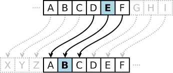

# Caesar Shift Cipher

## Introduction
The Caesar shift cipher was introduced during the Gallic Wars, during Rome's conquest of Gaul (modern-day France). The cipher is based on a cipher alphabet that was shifted a certain number of places (we'll call this the key, **k**) relative to the plain alphabet. 


> A Caesar shift of 3.


Suetonius, a Roman historian, mentioned that Caesar only used a shift of three places. But, it's clear to see that any shift between 1 and 25 would result in 25 distinct cipher alphabets. 

One of the main drawbacks of the Caesar shift is that it is extremely vulnerable to brute-force attacks. An attacker can simply try all possible values for **k** and would be able to decrypt the resulting message. 

In this assignment, you are given a ciphertext **c** (all in lowercase). You will need to brute-force all possible keys **k** in order to crack the code!

## Hints
It can be helpful to think of the "wrap-around" behavior of the Caesar shift with regards to the modulo function. Also, every `char` can be converted to its corresponding `int` for the ASCII character set.

## Tasks
* Brute-force all possible keys **k** in order to crack the Caesar shift cipher.
* When writing your solution, display each attempt for **k** on a separate line:
```
cclzmlu
bbkylkt
aajxkjs
...
```
* Out of the 25 possiblities, one message should make sense!


