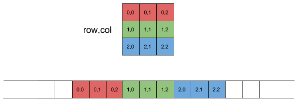
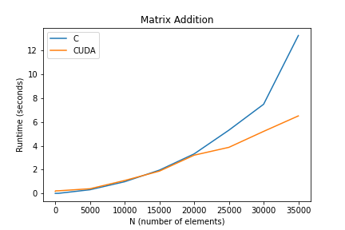

# Matrix Addition

## Introduction
In this module, we will explore GPU performance when it comes to matrix operations. Specifically, we will focus on matrix addition.

## C Implementation (`matrix_add.c`) and a Quick Refresher
Before you start implementing `matrix_add.c`, briefly recall the thought process behind matrix addition for two `N` X `N` matrices (building off of our previous implementation of vector addition).


## Matrix Representation
In general, dynamically allocated memory on the device (our GPU) doesn't allow for two-dimension row-column indexing (`my_matrix[row][col]`) to access 2-D arrays. C uses [**row-major**](https://en.wikipedia.org/wiki/Row-_and_column-major_order) order when storing our matrices--each row ends up being stored one after the other:



Write an expression that gets you the element`(row,col)` in an `N` X `N` matrix `M`. Your answer should be in terms of `row`, `col`, and `N`.\
`**TODO: Your answer here**`

Provided is some starter code for the **C** implementation of matrix addition (`matrix_add.c`).

```c
#include <stdio.h>
#include <stdlib.h>

#define N 5

void matrixAdd(int* a, int* b, int* c) {
    /* TODO */
    ...
}

void printMatrix(int* m) {
    /* TODO */
    ...
}

int main() {
    /* Allocate space for matrices a, b, and c */ 
    ...
    /* Populate each matrix with values */
    ...
    /* Display the answer */
    ...
    /* Free memory when done */
    ...
}
```

## Hints
### A Note on Dimensions
In comparison to `vector_add.cu`, note that we are now dealing with 2 dimensions. Recall from lecture that CUDA has built-in variables and structures to represent the current block and thread in each dimension.

## CUDA Implementation 
Create the corresponding CUDA implementation (`matrix_add.cu`). When making your call to the kernel, add a bounds check to make sure you are never accessing elements that are outside of the bounds of `N`. 

You should have a variable of `dim3` which represents the number of threads within each block. What is the range of acceptable values for this variable? Why is this the case?\
**TODO: Your answer here**

You might find a tool like [`cuda-memcheck`](https://docs.nvidia.com/cuda/cuda-memcheck/index.html) to be helpful here.

## Performance Case Study
We'll now perform a small case study on performance using the two implementations you just created: `matrix_add.c` and `matrix_add.cu`. When gathering your data, **don't** print the result of your calculated matrix--this will cause the runtime to be quite slow.

**TODO**: Use UNIX's [`time`](https://man7.org/linux/man-pages/man1/time.1.html) utility to fill in the following values for N below:

| N (# of elements)| `matrix_add.c` (sec) | `matrix_add.cu` (sec) |
| :--- | :--- | :--- |
| 5 | -- | -- |
| 50 | -- | -- |
| 500 | -- | -- |
| 5000 | -- | -- |
| 10000 | -- | -- |
| 15000 | -- | -- |
| 20000 | -- | -- |
| 25000 | -- | -- |
| 30000 | -- | -- |
| 35000 | -- | -- |

Once you have filled in the above values, make a graph to better visualize your findings. Use [Google Colab](https://colab.research.google.com/) to make a quick visualization, following the template for a similar graph below:

```python
import pandas as pd
import matplotlib.pyplot as plt
from google.colab import files

N = [...#TODO...]
matrix_add_perf_C = [...#TODO...]
matrix_add_perf_CUDA = [...#TODO...]

plt.plot(N, ...#TODO..., label='...#TODO...')
plt.plot(N, ...#TODO..., label='...#TODO...')
plt.xlabel(...#TODO...)
plt.ylabel(...#TODO...)
plt.title('Matrix Addition')
plt.legend()
plt.savefig('matrix_add_perf.png')
files.download('matrix_add_perf.png')
```

**TODO: Paste your version of `matrix_add_perf.png` below:**

**...**

Here is a sample graph for your reference:




## Tasks
* Implement `matrix_add.c` and `matrix_add.cu`
* Complete the **short answer questions** and populate the **table** with the data you collected
* Attach a picture of your performance graph (`matrix_add_perf.png`)